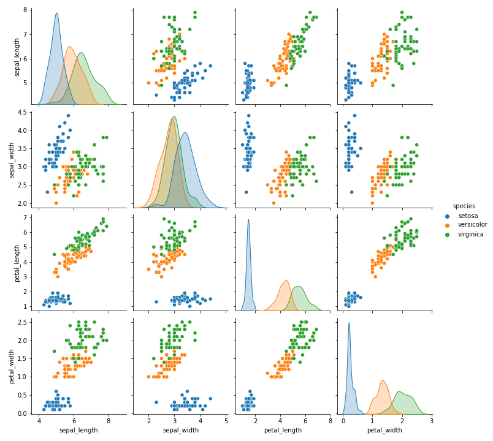

# 02 -- Data

## Learning goals

* Collaborative development with Colab
* Loading basic data structures from files
* Data viz with matplotlib

## Reading (for next week)

* [McKinney, Chapter 3](https://learning.oreilly.com/library/view/python-for-data/9781098104023/ch03.html)
  * Chapter title: Build-in data structures, functions, files
  * Along with McKinney reading from last week.

## In-class exercise -- collaborating with colab

* Colab -- https://colab.research.google.com/
  * Authenticate with your husky.neu.edu
  * Accessing the iris dataset
    * Look here: https://github.com/mwaskom/seaborn-data/blob/master/iris.csv
    * Use the "raw" link
    * `!curl -O "https://raw.githubusercontent.com/mwaskom/seaborn-data/master/iris.csv"
* **NEW** [colab.md](./colab.md)
  * Collaborative development with Colab

## In-class exercise: visualize iris

Picking up where we left off last week...

* Visualize the iris dataset to show the relationship between length and width of sepals.
  * you can do it with 3 lines of code
  ```
  import seaborn as sns
  data = sns.load_dataset("iris")
  sns.pairplot(data, hue="species");
  ```
  * Compare this with the [wikipedia scatterplot](https://en.wikipedia.org/wiki/Iris_flower_data_set)
  * [Visualization with Seaborn](https://github.com/jakevdp/PythonDataScienceHandbook/blob/master/notebooks/04.14-Visualization-With-Seaborn.ipynb) (4.14 of VanderPlas)
* Use matplotlib (no other packages) and use color to distinguish species, include a legend.
* Use only Python's [built-in functions](https://docs.python.org/3/library/functions.html),
[I/O methods](https://docs.python.org/3/tutorial/inputoutput.html)
and [string methods](https://docs.python.org/3/library/stdtypes.html?highlight=rstrip#string-methods),
and the matplotlib.
* Prototype in Colab, then migrate the result to a well-documented repo on github.
  * [solution](src/02-Data.md)
* We'll split this exercise up into several steps...

## Exercise #1

Write a function that reads a generic CSV file from your local filesystem.

* The function should return a list of dictionary objects.
* Assume the first row of the CSV file represents the dictionary keys.
* Each row after the first represents a set of dictionary values, with one dictionary per row.
* [solution](src/02-Data.md#exercise-1-detailed-rubric)

## File I/O

* [built-in functions](https://docs.python.org/3/library/functions.html)
* [`open()`](https://docs.python.org/3/library/functions.html#open)
  * `open()`returns a [file object](https://docs.python.org/3/glossary.html#term-file-object)
    * there are 3 types of file objects: raw binary, buffered binary, text
    * "the canonical way to create a file object is by using the `open()` function"
* If you google "file objects python", the 2nd link gets you to docs.python.org
  * As for the first link (it's geekstogeeks.com)? ...no comment.
* [File Objects](https://docs.python.org/3/c-api/file.html) -- docs.python.org
  * C API reference manual (looking under the hood)
  * [C API stability](https://docs.python.org/3/c-api/stable.html#stable) -- docs.python.org
  * [Stable Application Binary Interface](https://docs.python.org/3/c-api/stable.html#stable-application-binary-interface)
    * "All functions in the Stable ABI are present as functions in Python’s shared library, not solely as macros. This makes them usable from languages that don’t use the C preprocessor."
    * "The goal for the Limited API is to allow everything that is possible with the full C API, but possibly with a performance penalty."
  * [Platform considerations](https://docs.python.org/3/c-api/stable.html#platform-considerations)
  * ["Contents of limited API"](https://docs.python.org/3/c-api/stable.html#contents-of-limited-api)
    * note: this is a "limited" API
* [7. Input and Output](https://docs.python.org/3/tutorial/inputoutput.html) -- Python tutorial
  * [7.2 Reading and writing files](https://docs.python.org/3/tutorial/inputoutput.html#reading-and-writing-files)
    * `with` keyword

## Exercise #2

* Use matplotlib to visualize sepal length vs sepal width.
* Use color to distinguish species.
* Use the return value of the function you wrote in Exercise #1
* Add column labels and a color legend
* When you're done prototyping, make sure your code is modular and well documented.
* [solution](src/02-Data.md#exercise-2-detailed-rubric)

## Matplotlib overview

* [Python Data Viz](https://www.anaconda.com/blog/python-data-visualization-2018-why-so-many-libraries) in 2018
  * Part II: [Emerging trends](https://www.anaconda.com/blog/python-data-visualization-2018-moving-toward-convergence)
  * Part III: [Where do we go from here?](https://www.anaconda.com/blog/python-data-visualization-2018-where-do-we-go-from-here)
    * "I proposed my PyViz.org initiative as one step in that direction, with HoloViews and GeoViews providing a single and concise high-level declarative data API for using multiple InfoVis libraries..."
    * "Ben Root, representing Matplotlib, suggested that the large number of existing libraries was not necessarily an issue. He believes it’s entirely appropriate for Matplotlib to be the core workhorse for a large number of libraries building on it—not everything needs to be in Matplotlib itself, and Matplotlib makes an excellent basis on which to build other, higher-level 2D static-plotting functionality, due to its comprehensive support for low-level primitives and output formats."
    * "Noelle Held, from the audience, argued that her scientific colleagues have indeed been totally overwhelmed by the sheer number of plotting possibilities in Python, yet she saw the benefit of having so many different libraries available. It seems unlikely that all the separate package authors would be able to coordinate closely, but perhaps the SciPy community could do better at educating users..."
    * "Maarten Breddels, representing ipyvolume, bqplot, and ipywidgets, argued that ipywidgets (aka Jupyter widgets) is already emerging as a de facto standard, supported by a wide range of libraries (ipyvolume, ipyleaflet, pythreejs, bqplot, and now Plotly) that can now be mixed and matched as needed to provide interactive apps and plots in a Jupyter notebook."
    * Conclusions and Outlook: "Overall, it was clear that each of the main libraries represents a vibrant community of users and developers using different techniques to achieve different goals."

## Matplotlib scatter

* [pyplot.scatter API reference](https://matplotlib.org/stable/api/_as_gen/matplotlib.pyplot.scatter.html)
* [scatter plot demo](https://matplotlib.org/stable/gallery/shapes_and_collections/scatter.html)

## Exercise #3: Visualize penguins

Use the code from Exercises #1 and #2 to plot "bill_length_mm"
vs "flipper_length_mm" for 
[penguis.csv](https://github.com/allisonhorst/palmerpenguins/blob/master/inst/extdata/penguins.csv), 
using color to distinguish "species". 
If everything is nice and modular, it should be easy.

* [penguins dataset](https://allisonhorst.github.io/palmerpenguins/) -- this is a NICE data repository!
  * It's a [github pages](https://pages.github.com/) site -- every repository has one (optionally)
* [solution](src/02-Data.md#exercise-3-solution)

## Exercise #4: Create a well-documented repo

* Use Pandas
* [solution](src/02-Data.md#exercise-4-solution)

## Exercise #5: Create a well-documented repo

By the way, you can include an image in markdown.

* You can automatically download a figure using the google.colab.files module
  ```
  import seaborn as sns
  import matplotlib.pyplot as plt
  from google.colab import files

  data = sns.load_dataset("iris")
  sns.pairplot(data, hue="species");
  plt.savefig("iris.png")
  files.download("iris.png")
  ```
  * Or you can do by hand, because "iris.png" has been saved on the local filesystem
  * Note: we're using the fact that seaborn is built on matplotlib
    * matplotlib.pyplot has the "savefig()" function -- which saves the "current figure" as a PNG
  * See: [this article](https://www.anaconda.com/blog/python-data-visualization-2018-why-so-many-libraries)
    * It describes data viz with Python and answers the question: "Why so many data-viz libraries in Python?"
* If you google "add image to github markdown", then these are the top two links...
  * [stackoverflow post](https://stackoverflow.com/questions/14494747/how-to-add-images-to-readme-md-on-github)
    * highly ranked question and answer, with highly ranked comments
    * response #5 shows that you can use HTML directly, which allows you to resize image
  * [github docs](https://docs.github.com/en/get-started/writing-on-github/getting-started-with-writing-and-formatting-on-github/basic-writing-and-formatting-syntax)
    * authoritative documentation, but you'd need to know about HTML and markdown to get the resize option
* With sizing: 
* Without sizing: 
